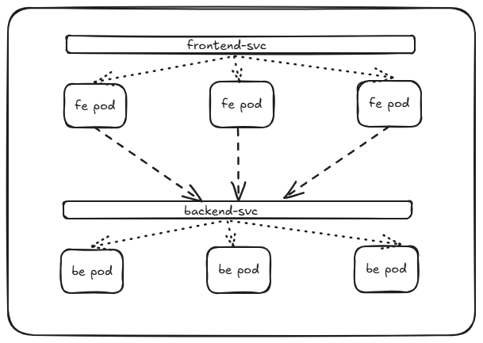

## Cluster IP
* `ClusterIP` services in kubernetes helps with communication between pods/services. 
* For example, a group of front-end pods exposed as a frontend-svc, a group of backend pods exposed as backend-svc. 
* ClusterIP enables communication between frontend-svc and backend-svc. The service randomly routes traffic to one of the backend pods. 
* Each service gets a name and a static IP which can be used for communication.
* Default service type


```yaml
version: v1 
kind: Service
metadata:
  name: backend-svc
spec:
  type: ClusterIP
  ports:
    - targetPort: 80
      port: 80
  selector:
    app: backend
```