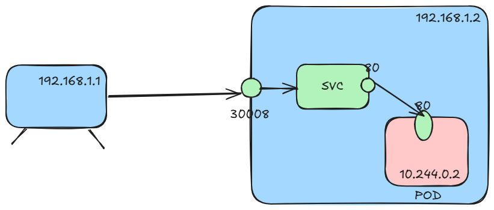

## Node Port
* Pods are exposed through a port on the Node.
* 3 Ports
  * NodePort - node port 
  * Port - service port. 
  * targetPort - container port
* only service port is mandatory. if targetPort is not specified, its assumed to be same as svc port. if nodePort is not specified, a random port in range 30000 - 32767 is assigned.
* if there are more than one matching pods, they are deployed in multiple nodes and mapped to the same node port on each node.

```yaml
apiVersion: v1
kind: Service
metadata:
  name: my-service
spec:
  type: NodePort
  ports:
    - nodePort: 30008
      port: 80
      targetPort: 80
  selector:
    app: my-app
```

```shell
#command to quickly create a svc. note: nodePort cannot be specified in the command. create svc and then edit the nodePort.
k expose deployment my-app --name my-service --port=80 --target-port=80 --type NodePort 
```